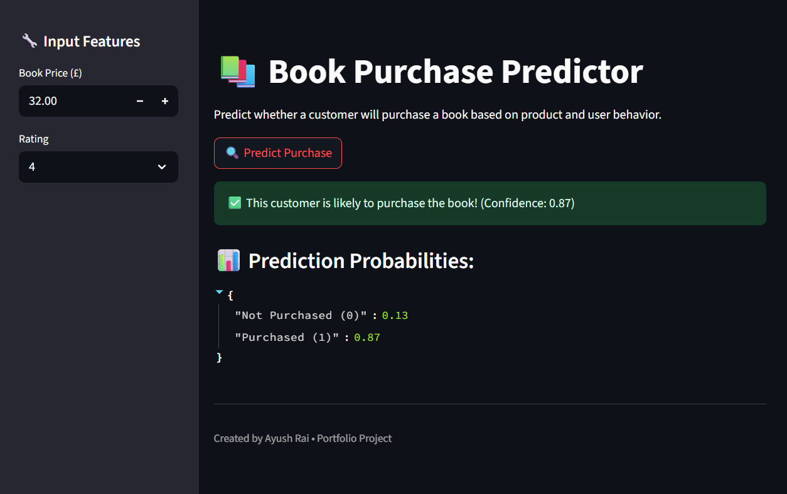

You can run the app locally: https://ecommerce-book-purchase-prediction-w4nn28jj7kpi8kckz9j7kk.streamlit.app/

📚 E-commerce Book Purchase Prediction

This is a simple, realistic data science project that simulates user behavior in an online bookstore.  
The goal? To predict whether a user will purchase a book based on how much it costs and how well it’s rated.

---

✨ What this project does

- Simulates real-world e-commerce behavior using scraped book data
- Creates realistic "purchase" labels based on price and rating
- Trains a machine learning model to predict if a customer will buy the book
- Deploys a simple, interactive Streamlit app where users can test predictions

---

🔍 Why this project matters

A lot of real-world data science work involves:
- Starting with messy or incomplete data
- Creating realistic labels or features
- Thinking carefully about what inputs really matter
- Keeping models clean and interpretable

This project reflects that process — from raw data all the way to a usable web app.

---

🛠️ Tools used

- **BeautifulSoup** – Web scraping product data
- **Pandas / NumPy** – Data handling
- **Scikit-learn** – Machine learning
- **Streamlit** – Interactive front-end
- **Joblib** – Saving the trained model

